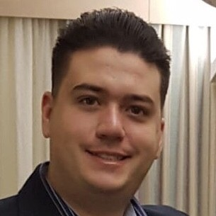

# Leandro Melloni Valle { align="right" width="100" }

## Quem sou eu?

Sempre tive uma experência profissional voltada a infraestrutura, trabalhando com as melhores práticas voltada a soluções `Microsoft`. Sempre fui aquela pessoa voltada a realizar automações para trabalhos repetitivos, automatizando fluxos que eram consideradas como rotinas em meu expediente, utilizando scripts `Shell` e `Powershell`.

Em 2018 iniciei meus estudos voltado a metodologia __DevOps__, porém estes estudos me levaram a outras vertentes, como `container`, `kubernetes`, `openshift`, etc.

Mas como falar em __DevOps__ sem falar em `Cloud`, então iniciei meus estudos voltados a `AWS` e `Azure`, e hoje estou focado em `AWS`, porém não deixo de lado a `Azure`, pois acredito que é importante conhecer as duas plataformas.

## Certificados

???- tip "{ width="30" } AWS"
    * [AWS Cloud Practitioner](https://www.youracclaim.com/badges/a0357f92-4b43-45a2-8a13-f9f8be96ace6/linked_in_profile)
    * [AWS Solutions Architect - Associate](https://www.youracclaim.com/badges/8a25ba1a-d73e-404b-8b25-aae06b7890c9?source=linked_in_profile)

???- tip "{ width="15" } Microsoft"
    * [Microsoft Certified: Azure Fundamentals](https://www.youracclaim.com/badges/5c514495-59ce-49e7-bdee-198ed06a369e?source=linked_in_profile)
    * [Exam 533: Implementing Microsoft Azure Infrastructure Solutions](https://www.youracclaim.com/badges/8438d50d-5997-4717-a769-e52936348212)
    * [MCPS: Microsoft Certified Professional](https://www.youracclaim.com/badges/138de575-e133-4639-96c8-f5c8bda46bc5/linked_in_profile)
