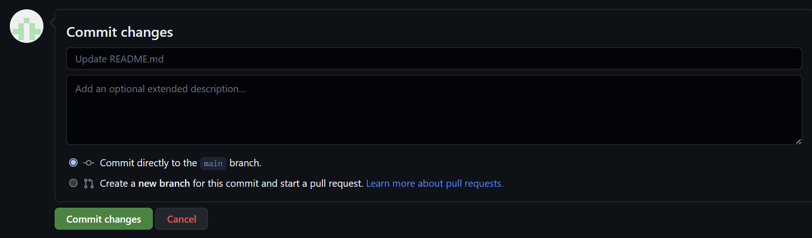

# Entendendo um pouco sobre Workflows!

## O que são Workflows?

Dentro do Github Actions, os Workflows são os fluxos de trabalho que serão executados através de comandos definidos dentro de `Jobs` e `Steps`, muitas pessoas chamam este fluxo como `Pipelines`, `Esteira de CI/CD`, etc. Iremos ver como funcionam cada um destes conceitos neste artigo.

## Eventos que podem disparar um Workflow

O Github Actions utiliza o conceito de eventos para disparar um Workflow, como por exemplo:

* `push` - Quando um `push` é realizado no repositório
* `pull_request` - Quando um `pull request` é realizado no repositório

Cada evento possui uma configuração diferente, por exemplo, quando um `push` é realizado no repositório, podemos definir que o Workflow será executado apenas quando um `push` for realizado na branch `main`, ou seja, quando um `push` for realizado em qualquer outra branch, o Workflow não será executado.

```yaml
on:
  push:
    branches: [ main ]
```

Para que este tipo de workflow seja executado, minimamente os comandos `git` abaixo devem ser executados a partir de uma alteração de um arquivo:

```cmd
git add .
git commit -m "Adicionando arquivo de configuração do Workflow"
git push origin main
```

ou se preferir, pode utilizar a própria interface da plataforma do Github para realizar o `push`:



## Como funciona um Workflow?

Um Workflow é composto por `Jobs`, que por sua vez são composto por `Steps`, onde cada `Step` é um comando que será executado dentro do `Job`. Segue um exemplo de utilização de um Workflow:

```yaml
jobs: # Configuração de Jobs do Workflow
  test: # Nome do Job
    name: Test # Nome do Job exibido durante a execução do Workflow
    runs-on: ubuntu-latest # Define o Runner que será utilizado para executar o Job
    steps: # Configuração de Steps do Job
      - name: Run a one-line script # Nome do Step
        run: echo Hello, world! # Comando que será executado dentro do Job
```

Como podemos ver no exemplo acima, dentro do Github Actions utilizamos o conceito de `YAML` para definir os Workflows, este arquivo deve ficar dentro da pasta `.github/workflows` do repositório que será utilizado para executar o Workflow.

## Jobs

Um Job é um conjunto de `Steps` que serão executados dentro de um Runner, um Runner é uma máquina virtual que será utilizada para executar os Jobs, por exemplo, podemos definir que um Job será executado em uma máquina virtual com o sistema operacional `Ubuntu`, ou seja, o Github Actions irá provisionar uma máquina virtual com o sistema operacional `Ubuntu` e executará os `Steps` dentro desta máquina virtual.

Para definir qual runner será utilizado para executar o Job, utilizamos o parâmetro `runs-on`, onde podemos definir o sistema operacional que será utilizado para executar o Job, por exemplo:

```yaml
jobs:
  test:
    name: Test
    runs-on: ubuntu-latest
```

Runners disponíveis:

* `ubuntu-latest`: Dentro deste Runner, será provisionada uma máquina virtual com o sistema operacional `Ubuntu` mais recente. Caso seja seu desejo, outras versões podem ser utilizadas, por exemplo, `ubuntu-18.04`, `ubuntu-20.04`, etc.
* `windows-latest`: Dentro deste Runner, será provisionada uma máquina virtual com o sistema operacional `Windows` mais recente. Caso seja seu desejo, outras versões podem ser utilizadas, por exemplo, `windows-2016`, `windows-2019`, etc.
* `macos-latest`: Dentro deste Runner, será provisionada uma máquina virtual com o sistema operacional `MacOS` mais recente. Caso seja seu desejo, outras versões podem ser utilizadas, por exemplo, `macos-10.15`, `macos-11.0`, etc.

Para mais informações de runners disponíveis, acessar o link: [https://docs.github.com/en/actions/reference/specifications-for-github-hosted-runners](https://docs.github.com/en/actions/reference/specifications-for-github-hosted-runners)

## Steps

Um Step é um comando que será executado dentro do Job, por exemplo, podemos definir que um Step irá executar um comando `echo` para exibir uma mensagem na tela, ou seja, o Github Actions irá executar o comando `echo` dentro do Job.

Para definir um Step, utilizamos o parâmetro `run`, onde podemos definir o comando que será executado dentro do Job, por exemplo:

```yaml
steps:
  - name: Run a one-line script
    run: echo Hello, world!
```

Além do parâmetro `run`, podemos utilizar outros parâmetros para definir um Step, por exemplo:

* `name`: Nome do Step que será exibido durante a execução do Workflow
* `uses`: Define o nome de uma action que será executada dentro do Step
    - `with`: Define os parâmetros que serão utilizados dentro da action

!!! warning "Atenção"
    * Para utilizar o parâmetro `uses`, é necessário que a action esteja publicada no Github Marketplace, caso contrário, o Github Actions irá retornar um erro.
    * Caso utilize o parâmetro `uses`, o parâmetro `run` não poderá ser declarado e vice-versa.

## Conclusão

Neste artigo, vimos como funciona um Workflow em seu conceito básico. Utilizando o Github Actions, é muito simples criar Workflows para automatizar tarefas, por exemplo, podemos criar um Workflow para executar testes unitários, ou até mesmo para realizar o deploy de uma aplicação, utilizando comandos `shell`(linux), `powershell`(windows) ou `actions` que se encontram no Marketplace para execuções de tarefas mais complexas.

Para mais informações, acesse os links de referência.

## Links de referência

* [https://docs.github.com/en/actions/reference/workflow-syntax-for-github-actions](https://docs.github.com/en/actions/reference/workflow-syntax-for-github-actions)
* [https://docs.github.com/en/actions/using-workflows/events-that-trigger-workflows](https://docs.github.com/en/actions/using-workflows/events-that-trigger-workflows)
* [https://docs.github.com/en/actions/learn-github-actions/workflow-syntax-for-github-actions](https://docs.github.com/en/actions/learn-github-actions/workflow-syntax-for-github-actions)
